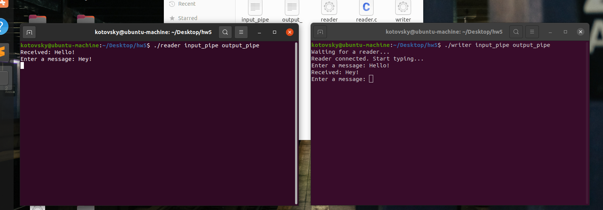

## Домашнее задание №5.
### Котовский Семён Олегович, БПИ-219.

#### Задание: 

Разработать программы на языке C, реализующие двусторонний обмен данными по именованным каналам (через pipes). 
То есть организовать их взаимодействие как независимых процессов.
Имена каналов для обмена сообщениями передавать через аргументы командной строки.

#### Решение:

Реализация на языке C, использующая именованные каналы для двусторонней связи между двумя независимыми процессами. 
Программа принимает имена входного и выходного каналов в качестве аргументов командной строки.

Для компиляции программ следует использовать следующие команды в терминале:

```bash
gcc -o writer writer.c
gcc -o reader reader.c
./writer input_pipe output_pipe
./reader input_pipe output_pipe
```

1. Процесс А - писатель (передатчик):

```c
#include <stdio.h>
#include <stdlib.h>
#include <string.h>
#include <fcntl.h>
#include <sys/stat.h>
#include <sys/types.h>
#include <unistd.h>

#define MAX_BUFFER_SIZE 1024

int main(int argc, char *argv[])
{
    int input_fd, output_fd;
    char input_buffer[MAX_BUFFER_SIZE], output_buffer[MAX_BUFFER_SIZE];

    if (argc != 3) {
        fprintf(stderr, "Usage: %s <input pipe> <output pipe>\n", argv[0]);
        return 1;
    }

    mkfifo(argv[1], 0666);
    mkfifo(argv[2], 0666);

    printf("Waiting for a reader...\n");

    output_fd = open(argv[1], O_WRONLY);
    input_fd = open(argv[2], O_RDONLY);

    printf("Reader connected. Start typing...\n");

    while (1) {
        printf("Enter a message: ");
        fflush(stdout);
        fgets(input_buffer, MAX_BUFFER_SIZE, stdin);
        write(output_fd, input_buffer, strlen(input_buffer) + 1);
        read(input_fd, output_buffer, MAX_BUFFER_SIZE);
        printf("Received: %s", output_buffer);
    }

    return 0;
}
```

1. Процесс B - читатель (приёмник):

```c
#include <stdio.h>
#include <stdlib.h>
#include <string.h>
#include <fcntl.h>
#include <sys/stat.h>
#include <sys/types.h>
#include <unistd.h>

#define MAX_BUFFER_SIZE 1024

int main(int argc, char *argv[])
{
    int input_fd, output_fd;
    char input_buffer[MAX_BUFFER_SIZE], output_buffer[MAX_BUFFER_SIZE];

    if (argc != 3) {
        fprintf(stderr, "Usage: %s <input pipe> <output pipe>\n", argv[0]);
        return 1;
    }

    input_fd = open(argv[1], O_RDONLY);
    output_fd = open(argv[2], O_WRONLY);

    while (1) {
        read(input_fd, input_buffer, MAX_BUFFER_SIZE);
        printf("Received: %s", input_buffer);
        printf("Enter a message: ");
        fflush(stdout);
        fgets(output_buffer, MAX_BUFFER_SIZE, stdin);
        write(output_fd, output_buffer, strlen(output_buffer) + 1);
    }

    return 0;
}
```

#### Примечание: 
Программы будут выполняться неограниченное время, пока вы их не остановите.Чтобы остановить их, вы можете использовать Ctrl+C или послать сигнал процессу.

#### Логика программ:

Программа writer предназначена для записи данных в именованную трубу. Сначала она проверяет, что было предоставлено правильное количество аргументов командной строки (т.е. имена входных и выходных труб), и печатает сообщение об ошибке, если это не так. Затем программа создает входной и выходной каналы с помощью mkfifo и открывает их для чтения и записи с помощью open.

Затем программа входит в цикл, в котором она предлагает пользователю ввести сообщение, используя printf и fgets. Затем программа записывает сообщение в выходной канал с помощью write и ждет ответа от процесса чтения с помощью read. После получения ответа программа выводит его на экран с помощью printf.

Программа чтения предназначена для чтения данных из именованной трубы. Как и программа-писатель, она сначала проверяет, что было предоставлено правильное количество аргументов командной строки, и печатает сообщение об ошибке, если это не так. Затем она открывает входной и выходной каналы для чтения и записи с помощью open.

Затем программа входит в цикл, в котором считывает данные из входной трубы с помощью read, выводит данные на экран с помощью printf, предлагает пользователю ввести ответ с помощью printf и fgets и записывает ответ в выходную трубу с помощью write.

Вместе эти программы используют именованные трубы, чтобы позволить двум независимым процессам обмениваться данными друг с другом. Программа-писатель записывает данные в выходной канал, а программа-читатель считывает их из входного канала. И наоборот, программа чтения записывает данные в выходную трубу, а программа записи считывает их из входной трубы. Благодаря постоянному обмену данными таким образом, два процесса могут взаимодействовать друг с другом, даже если они работают независимо друг от друга.
#### Как работать с программами?

Вы можете запустить программы записи и чтения из терминала, скомпилировав их с помощью компилятора C, а затем запустив их с соответствующими аргументами командной строки.

Ниже описаны шаги по компиляции и запуску программ в терминале:

#### 1. Откройте окно терминала и перейдите в каталог, где сохранены файлы исходного кода.

#### 2. Скомпилируйте программы записи и чтения отдельно с помощью компилятора языка Си, например gcc. Например, чтобы скомпилировать программу writer, выполните следующую команду:

```bash
gcc writer.c -o writer
```

Эта команда компилирует файл исходного кода writer.c и создает исполняемый файл с именем writer.

Аналогичным образом скомпилируйте программу чтения, используя следующую команду:


```bash
gcc reader.c -o reader
```

#### 3. После компиляции программ запустите программу чтения в отдельном окне терминала с помощью следующей команды:

```bash
./reader <input_pipe> <output_pipe>
```


Замените <input_pipe> и <output_pipe> именами входных и выходных труб, которые вы хотите использовать для связи. Например:


```bash
./reader input_pipe output_pipe
```

#### 4. В исходном окне терминала запустите программу writer, используя следующую команду:

```bash
./writer <input_pipe> <output_pipe>
```


Снова замените <input_pipe> и <output_pipe> на имена входных и выходных труб, которые вы хотите использовать для связи. Например:

```bash
./writer input_pipe output_pipe
```
Когда программы будут запущены, вы сможете обмениваться данными между программами записи и чтения, используя названные трубы.
    
Чтобы остановить программы, вы можете использовать Ctrl+C в каждом окне терминала, чтобы послать сигнал SIGINT соответствующему процессу, что приведет к его завершению. Вы также можете использовать kill <PID>, чтобы послать сигнал определенному процессу, где <PID> - это идентификатор процесса, который вы хотите убить.

#### Программы в действии:


